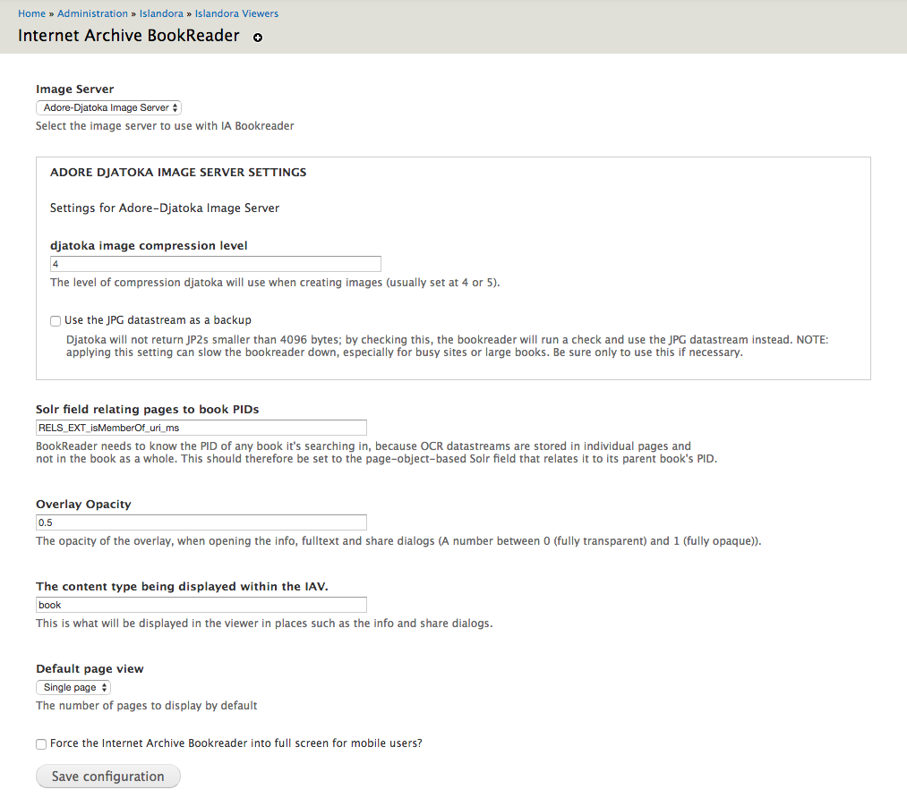
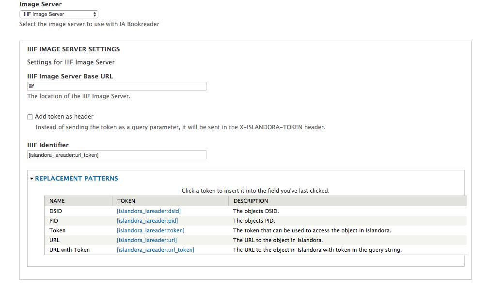

# Islandora Internet Archive BookReader 

## Introduction

An Islandora wrapper for the Internet Archive BookReader.

This module doesn't do much on its own, its assummed that it will be used in conjunction with a solution pack, where it will be enabled as a viewer.

## Requirements

This module requires the following modules/libraries:

* [Islandora](https://github.com/islandora/islandora)
* [Islandora Paged Content](https://github.com/islandora/islandora_paged_content)
* [Libraries API](https://www.drupal.org/project/libraries)
* [Colorbox](https://www.drupal.org/project/colorbox)
* [Drupal Token Module](https://www.drupal.org/project/token)

And one (1) of the following Image Server options

* [Djatoka](http://sourceforge.net/apps/mediawiki/djatoka/index.php?title=Main_Page)
* [An IIIF Image API compliant Image Sever](#iiif)

This module has the following as optional requirements for certain features:

Allows OCR based search using the Viewer's Search box.

* [Islandora Solr Search](https://github.com/Islandora/islandora_solr_search/) (recommended)

## Installation

Install as usual, see [this](https://drupal.org/documentation/install/modules-themes/modules-7) for further information.

Download/clone our fork of the [Internet Archive BookReader](https://github.com/Islandora/internet_archive_bookreader.git) to `sites/all/libraries/bookreader`, or run `drush iabookreader-plugin`. This is currently the only version we support.

This module requires that you set up either Djatoka or an IIIF Image API compliant Image Sever. For Djatoka please follow the steps outlined at [here](https://wiki.duraspace.org/display/ISLANDORA/Djatoka).

This module requires [Colorbox](https://www.drupal.org/project/colorbox) and its dependant library [Colorbox library](http://www.jacklmoore.com/colorbox/). Depending on the version of the Colorbox module and library you are using, there can be some issues with Colorbox finding the library. [This](https://www.drupal.org/node/1074474#comment-9137159) comment solves the issue.

Note: If you use the Drush command, it is advisable to Move (not copy) the [install script](https://github.com/islandora/islandora_internet_archive_bookreader/blob/7.x-1.11/islandora_internet_archive_bookreader.drush.inc) to your `.drush` folder before running it.

## Configuration

### Common settings

You can setup which 'Solr field relating pages to book PIDs' is used, the amount of 'Overlay Opacity', what content type is to be displayed to final users within the Internet Archive Book Reader Viewer, the 'Default page view' mode and the full screen behaviour for mobile users in Administration » Islandora » Islandora Viewers » Internet Archive BookReader (/admin/islandora/islandora_viewers/internet_archive_bookreader). 

### Image server selection

This module is able to use either Adore-djatoka or an IIIF Image API compliant Image Server as source for each book's page image.

#### Adore-djatoka

Djatoka specific options are:

 * Compression level (the larger the number, the lower the quality but also the smaller the file size)
 * Using an Object's JPG datastream as a backup in case Djatoka cannot return a JP2.

Note: The Adore-datoka Server URI (Open URL endpoint) must be set from [Islandora Paged Content](https://github.com/islandora/islandora_paged_content) Solution Pack's admin settings.

#### IIIF

Any [IIIF](http://iiif.io) image server can be used as the IIIF tile source.

The IIIF Image Server Base URL needs to be setup here. This URL can be relative or absolute but needs to be openly accessible to a visiting user (Ajax).

This module provides `Drupal tokens` to allow highly configurable replacement patterns to be used for the `IIIF identifier` creation.

These `IIIF identifier` are send to the IIIF Image server where they are resolved back into URLs that can be accessed by it and used as Source for its tile creation.

This resolvers need to be properly configured at the Image server level. E.g, a [Cantaloupe 🍈](https://medusa-project.github.io/cantaloupe/) IIIF image server can be configured to resolve these identifiers using the [`HttpResolver`](https://medusa-project.github.io/cantaloupe/manual/3.3/resolvers.html#HttpResolver) with no prefix specified.

Islandora also uses temporary authentication tokens to give backend services limited time access to protected resources (Datastreams). You can select if those tokens are passed as part of a `IIIF identifier` or via an HTTP Header.

## Documentation

Further documentation for this module is available at [our wiki](https://wiki.duraspace.org/display/ISLANDORA/Islandora+Internet+Archive+Bookreader).

## Troubleshooting/Issues

Having problems or solved a problem? Check out the Islandora google groups for a solution.

* [Islandora Group](https://groups.google.com/forum/?hl=en&fromgroups#!forum/islandora)
* [Islandora Dev Group](https://groups.google.com/forum/?hl=en&fromgroups#!forum/islandora-dev)

## Maintainers/Sponsors

Current maintainers:

* [Diego Pino](https://github.com/DiegoPino)

## Development

If you would like to contribute to this module, please check out [CONTRIBUTING.md](CONTRIBUTING.md). In addition, we have helpful [Documentation for Developers](https://github.com/Islandora/islandora/wiki#wiki-documentation-for-developers) info, as well as our [Developers](http://islandora.ca/developers) section on the [Islandora.ca](http://islandora.ca) site.

## License

[GPLv3](http://www.gnu.org/licenses/gpl-3.0.txt)
