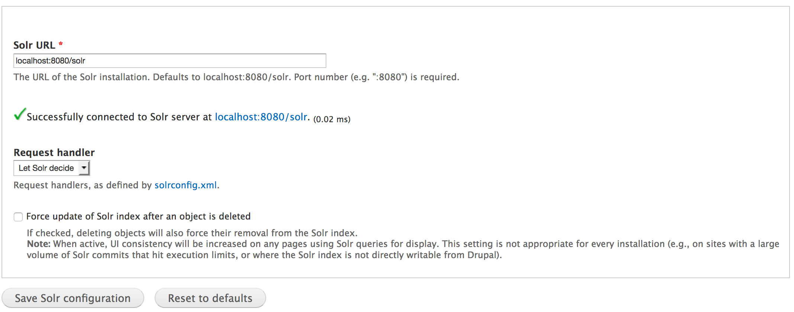
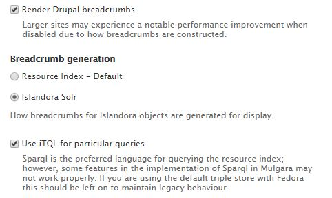

# Islandora Solr 

## Introduction

Islandora Solr provides a highly configurable interface to perform Solr queries and display Solr data in different ways.

## Requirements

This module requires the following modules/libraries:

* [Islandora](https://github.com/islandora/islandora)
* [Tuque](https://github.com/islandora/tuque)
* [Apache Solr](https://lucene.apache.org/solr/) - 4.2 or higher.

## Installation
 
 Install as usual, see [this](https://drupal.org/documentation/install/modules-themes/modules-7) for further information.
 
## Configuration
 
Set the 'Solr URL' and select a 'Request handler' in Administration » Islandora » Solr Index (admin/islandora/search/islandora_solr).

Islandora Solr offers many more configuration options in Administration » Islandora » Solr Index » Solr settings (admin/islandora/search/islandora_solr/settings). These settings are explained in detail on the [Solr Settings](https://wiki.duraspace.org/display/ISLANDORA/Islandora+Solr+Settings) page on the wiki.

Configuration of the labels attached to the Islandora Simple Search can be done via the block's configuration settings.

Islandora Solr also implements the query backend that allows the Islandora Basic Collection solution pack to drive the collection display using Solr instead of SPARQL/Fedora. This functionality can be applied on the collection solution pack's configuration page (admin/islandora/solution_pack_config/basic_collection), and that same page provides settings for sorting the Solr collection view globally and per-collection. The query backend relies on the relationship fields in the "Required Solr Fields" section of the Solr settings; the fields in that section should be confirmed before using Solr to drive the display.

### Breadcrumbs
To enable breadcrumbs, browse to Administration » Islandora » Configuration and choose **Islandora Solr** under **Breadcrumb generation**.

## Documentation

Further documentation for this module is available at [our wiki](https://wiki.duraspace.org/display/ISLANDORA/Islandora+Solr).

## Troubleshooting/Issues
 
 Having problems or solved a problem? Check out the Islandora google groups for a solution.
 
 * [Islandora Group](https://groups.google.com/forum/?hl=en&fromgroups#!forum/islandora)
 * [Islandora Dev Group](https://groups.google.com/forum/?hl=en&fromgroups#!forum/islandora-dev)
 
## FAQ

Q. Why are some dates not rendered correctly?
 
A. On 32 bit systems, the PHP function `strtotime()` has a limited range. Typically from Fri, 13 Dec 1901 20:45:54 UTC to Tue, 19 Jan 2038 03:14:07 UTC. For more info see [the notes for `strtotime()`](https://secure.php.net/manual/en/function.strtotime.php#refsect1-function.strtotime-notes).

Q: Why can't I connect to Solr via https?

A: The Apache Solr PHP Client that we use does not support https connections to Solr. [ISLANDORA-646](https://jira.duraspace.org/browse/ISLANDORA-646) seeks to remedy this.

Q: Advanced search on PID worked in 6.x. Why do I get no results for the same search in 7.x?

A: In 7.x the colon in a PID must be escaped with a backslash (i.e., islandora:34 becomes islandora\:34) or the entire query must be wrapped in quotation marks  (i,e., "islandora:34").

## Maintainers/Sponsors

Current maintainers:

* [Jared Whiklo](https://github.com/whikloj)

## Development

If you would like to contribute to this module, please check out [CONTRIBUTING.md](CONTRIBUTING.md). In addition, we have helpful [Documentation for Developers](https://github.com/Islandora/islandora/wiki#wiki-documentation-for-developers) info, as well as our [Developers](http://islandora.ca/developers) section on the [Islandora.ca](http://islandora.ca) site.

## License

[GPLv3](http://www.gnu.org/licenses/gpl-3.0.txt)
